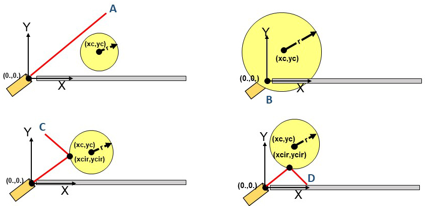

# CUDA_Monte_Carlo

The Scenario

A laser is pointed at a circle, which is defined by a center point (xc, yc) and a radius (r).  The beam comes out at a 30 degree angle and may deflect off the circle.  Underneath the circle is an infitely long plate.  What is the probability the beam hits the plate?  Typcially this is a straighforward gemoetric calculation, but the circle is randomly changing locations and size.  This is an ideal job for a GPU Monte Carlo simulation with CUDA because of the variability.  

There are four scenarios that can depicted from the image above:
(A) The beam completely misses the circle.
(B) The circle engulfs the laser.
(C) The beam bounces off the circle, misses the plate, and is directed off into space. 
(D) The beam bounces off the circle and successfully hits the plate.

The project will be run with four block sizes (number of threads per block) of 16, 32, 64, and 128; and trial sizes of 16384, 32768, 65536, 131072, 262144, 524288, 1024000.
